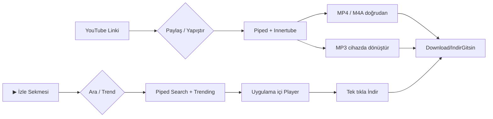

<div align="center">


# İndir Gitsin

### YouTube & YouTube Music için en hızlı, en sade indirici + Tubular tarzı izleyici

**Link yapıştır** veya **YouTube → Paylaş → İndir Gitsin** de, gerisini o halleder. Yeni **▶ İzle** sekmesi ile YouTube'u **uygulamayı terk etmeden** ara, trendleri keşfet, reklamsız izle ve tek tıkla indir.

<br/>

[](https://github.com/keremmkilincc-wq/indirgitsin/releases)
[](https://github.com/keremmkilincc-wq/indirgitsin/actions)
[](https://github.com/keremmkilincc-wq/indirgitsin/releases)
[](LICENSE)
[](https://github.com/keremmkilincc-wq/indirgitsin/releases)

<br/>

[📥 APK İndir](https://github.com/keremmkilincc-wq/indirgitsin/releases/latest) • [🌐 Canlı Demo](#-hızlı-başlangıç) • [📖 Dokümantasyon](#-proje-yapısı) • [🐛 Hata Bildir](https://github.com/keremmkilincc-wq/indirgitsin/issues)

</div>

---

## ✨ Neden İndir Gitsin?

<table>
<tr>
<td width="50%">

**Tek dokunuşta** YouTube, YouTube Music, Shorts ve youtu.be linklerini çözümler. Sunucusuz doğrudan mod ile **MP4 / M4A doğrudan cihaza** iner, **MP3 cihazda FFmpeg.wasm ile** dönüştürülür. İstersen kendi backend’ini ekleyip 1080p+ ve birleştirme için kullanırsın. **Yeni v1.7.4:** Tubular/NewPipe ilhamlı **▶ İzle** sekmesi — Piped + Innertube ile arama/trend, uygulama içi oynatıcı, izlerken indir.

</td>
<td width="50%">



</td>
</tr>
</table>

---

## 🎬 Ekran Görüntüleri

<div align="center">

| İndir | ▶ İzle | ⚡ Shorts | 📁 Dosyalar | Geçmiş | Hakkında |
|---|---|---|---|---|---|
| Link yapıştır, indir | Trend/arama, kanal & yorum | Dikey akış, 9:16 | Dosya yöneticisi | Grid, sil | v1.7.4, dil |
| *Hero + Preview* | *Kanal, yorum, abone, önerilen* | *Shorts grid, player* | *Oynat/paylaş/sil* | *30 kayıt* | *5 dil, tema* |

> **İpucu:** `assets/icon.svg` ve `manifest.json` ile tam PWA — ana ekrana ekle, uygulama gibi kullan.

</div>

---

## 🚀 Özellikler

| Özellik | Açıklama |
|---|---|
| 🔗 **Evrensel Link** | `youtube.com`, `youtu.be`, `music.youtube.com`, `m.youtube.com`, `Shorts` |
| 📤 **Paylaş → İndir Gitsin** | Android `SEND` + `VIEW` intent-filter, `MainActivity.java` native bridge |
| 🎬 **Video** | MP4 360p / 480p / 720p / 1080p (progressive doğrudan) |
| 🎵 **Ses** | M4A (128kbps), OPUS, **MP3 cihazda dönüştür** (FFmpeg.wasm 0.11 & 0.12 dual) |
| ⚡ **Sunucusuz** | Piped → Innertube fallback, `nativeFetch` + `CapacitorHttp` CORS bypass, `Filesystem.downloadFile` + `DownloadManager` |
| ▶️ **İzle** | **Tubular/NewPipe tarzı:** Piped Search + `/trending?region=TR`, Innertube fallback, inline `video` player, izlerken **⬇ İndir** + **Kanal (avatar/subs/abone) + Yorumlar + Önerilenler** |
| ⚡ **Shorts (Yeni v1.7.4)** | Dikey 9:16 feed, `Piped search shorts`, 2 kolon grid, dikey player, kaydırarak keşfet, Shorts'u da indir |
| 📁 **İndirilenler (Yeni v1.7.4)** | **Dosya Yöneticisi:** `İndirilenler/IndirGitsin` geçmişini listeler, video/ses filtre, oynat/ paylaş/ sil/ klasörde göster, sayaç + native `Filesystem.readdir` |
| 🧩 **Sekmeli UI** | `İndir / İzle / Shorts / Dosyalar / Geçmiş / Hakkında` 6 sekme, `bottom-nav` tab, akıcı `tabIn` + shimmer, sticky glass header, modern polish |
| 🌐 **Çoklu Dil (Yeni v1.7.4)** | **Ayarlar → Dil:** 🇹🇷 TR / 🇬🇧 EN / 🇩🇪 DE / 🇸🇦 AR (RTL) / 🇷🇺 RU — `localStorage` persist, `data-i18n` anında çeviri |
| 🕘 **Geçmiş** | Grid, format badge (video/cyan, audio/amber), `az önce / 3dk / dün`, oynat ▶ & sil ✕, 30 kayıt |
| ▶️ **Oynat** | Geçmişteki her videoyu/müziği taze URL ile `video`/`audio` modal’da oynat, YouTube’a git; İzle'de seçili videoyu sayfa içinde oynat |
| 🔄 **Otomatik Güncelleme** | `api.github.com/releases/latest` 4 saatte bir, banner + `🔄` buton, `APK İndir` native bridge |
| 🎨 **Modern & Responsive** | Glassmorphism, gradient `Outfit` + `Inter`, dark/light persist, 980/768/640/380 breakpoint, `izle-card` hover, compact |
| 🧪 **APK’sız Test** | `python -m http.server 8000` ile tarayıcıda birebir test (İzle dahil) |

---

## 🧠 Teknoloji

| Katman | Teknoloji | Neden bu? |
|---|---|---|
| **Frontend** | PWA `HTML/CSS/JS` + `Capacitor 6` | Tek kod tabanı, tarayıcıda test + native APK, WebView sarmalama |
| **Backend (opsiyonel)** | `Python FastAPI` + `yt-dlp` + `ffmpeg` | En stabil extractor, hem normal hem Music, MP3 birleştirme |
| **Android** | `Capacitor 6`, `DownloadManager`, `FileProvider` | Share Intent, `usesCleartextTraffic`, `file_paths.xml`, Play Store uyumlu |
| **MP3 Dönüşüm** | `FFmpeg.wasm` | Sunucu yoksa cihazda M4A→MP3, fallback `m4a as mp3` |
| **CI/CD** | `GitHub Actions` | `push main` / `tag v*` → `assembleDebug` + Release + artifact |

> **Alternatif:** Flutter değerlendirildi ama Windows’ta hızlı prototipleme ve APK’sız web test için PWA+Capacitor daha hafif ve hızlı.

---

## ⚡ Hızlı Başlangıç

### 1) Tarayıcıda (backend’siz, sunucusuz)

```bash
# klonla
git clone https://github.com/keremmkilincc-wq/indirgitsin.git
cd indirgitsin

# önizle
python -m http.server 8000
# → http://localhost:8000
# Örnek butonlarla dene, MP4/M4A doğrudan, MP3 cihazda dönüşür
```

### 2) Backend ile (gerçek, 1080p+ ve hızlı MP3)

```bash
pip install -r server/requirements.txt
# ffmpeg kurulu olmalı: https://ffmpeg.org
python server/app.py
# → http://localhost:8000
# ⚙️ Sunucu ayarı: http://192.168.1.15:8000 (ipconfig ile bul)
```

### 3) APK Kurulum (kullanıcı)

1. [Releases](https://github.com/keremmkilincc-wq/indirgitsin/releases/latest) → `app-debug.apk` indir
2. Android’de `Bilinmeyen kaynaklara izin ver` → kur
3. YouTube’da bir video → **Paylaş → İndir Gitsin** → kalite seç → `İndirilenler/IndirGitsin` klasöründe
4. **Yeni v1.7.4:** Uygulamayı aç → **▶ İzle** → ara veya Trend'e göz at → video seç → uygulama içinde izle → beğendiysen **⬇ İndir**

---

## 📱 Android APK Oluşturma

### Lokal (Android Studio)

```bash
npm install
npx cap add android      # ilk kez
npx cap sync android
npx cap open android
# Android Studio → Build → Build APK(s)
```

Önemli dosyalar:
* `android/app/src/main/AndroidManifest.xml` → `SEND`/`VIEW` intent-filter + `usesCleartextTraffic`
* `android/app/src/main/res/xml/file_paths.xml` → `FileProvider` (yoksa build hatası)
* `.github/MainActivity.java` → `DownloadManager` + `window.Android.download(url, filename)` bridge + `handleIntent`

### Otomatik (GitHub Actions)

```bash
git tag v1.7.4
git push origin v1.7.4
# veya
git push origin main
```

`release.yml` adımları: `Prepare web assets (→ www/)` → `npm install` → `cap add/sync` → `Patch Manifest & MainActivity + file_paths.xml` → `gradlew assembleDebug` → artifact + Release.

Workflow badge’ini yukarıda görebilirsin. Her `main` push’u `v<run_number>` Release’i de oluşturur.

---

## 📂 Proje Yapısı

```
kozauygulama/
├─ index.html                 # Tabbed UI: indir / izle / geçmiş / hakkında (İzle: arama + trending + inline player)
├─ manifest.json              # PWA + share_target + shortcuts
├─ capacitor.config.json      # appId: com.indirgitsin.app, webDir: www
├─ package.json               # v1.7.4
├─ assets/
│  ├─ app.js                  # 1700+ satır: fetchInfo (Piped→Innertube), izleSearch (Piped Search/Trending → Innertube fallback), nativeFetch, downloadViaNative, ffmpeg dual, history, player, update
│  ├─ style.css               # Glassmorphism, responsive, tab, izle-grid/card, history grid, about hero
│  └─ icon.svg
├─ www/                       # Build çıktısı (index + assets kopyası, cap sync için)
├─ server/
│  ├─ app.py                  # FastAPI: /api/health, /api/info, /api/download
│  └─ requirements.txt
├─ android/                   # Capacitor android (gradlew, app/src/main/...)
│  ├─ app/src/main/AndroidManifest.xml
│  └─ app/src/main/res/xml/file_paths.xml
├─ .github/
│  ├─ workflows/release.yml
│  ├─ AndroidManifest.xml     # Template (CI’da kopyalanır)
│  └─ MainActivity.java       # Template (CI’da kopyalanır)
└─ README.md
```

---

## 🔌 API

| Endpoint | Açıklama |
|---|---|
| `GET /api/health` | `{"ok": true, "yt_dlp": true, "ffmpeg": true}` |
| `GET /api/info?url=...` | `{id, title, channel, duration, views, thumbnail, formats[]}` |
| `GET /api/download?url=...&format_id=...&ext=...` | Dosya stream (`Content-Disposition` ile) |

Frontend önce `Piped/Innertube` ile dener, backend sadece `hasServer=true` ise veya MP3 sunucu modunda kullanılır.

---

## 🎨 Arayüz Detayları

* **Sekmeler:** `bottom-nav` → `switchTab('indir'|'izle'|'gecmis'|'hakkinda')`, `tabIn` keyframe, `window.scrollTo(0)` — İzle lazy-load: ilk açılışta `trend` trending çekilir
* **Hero:** `badge` + `gradient-text` + `input-wrapper:focus-within` + `chips` yatay scroll (İzle'de 8 chip: Trend/Müzik/Oyun...)
* **Preview/Options:** `filter-tabs` (Tümü/Video/Ses), `option` hover lift, `download-btn` gradient
* **İzle:** `izle-grid` auto-fill 260px, `izle-card` thumb + duration/views badge + play overlay, `izlePlayerWrap` inline `video` + `fetchInfo` taze MP4, `Daha fazla yükle` nextpage
* **Geçmiş:** `grid auto-fill 280px`, `history-badge`, `history-play` gradient, `history-delete` hover
* **Player Modal:** `playerModal` → `video`/`audio` toggle, `fetchInfo` taze URL, fallback YouTube link (İzle'de modal yerine inline player)
* **About:** `about-hero` gradient + radial overlay, `about-features` 2×2 grid, `about-stats` (v1.7.4)

---

## ❓ SSS

**M4A/MP3 inmiyor?** GoogleVideo linkleri CORS’lu. `nativeFetch` + `CapacitorHttp` ve `Filesystem.downloadFile` ile bypass ediliyor. MP3 için `FFmpeg.wasm` 0.11/0.12 dual destek var, internet zayıfsa `m4a as mp3` fallback devreye girer.

**1080p neden yok?** Progressive MP4’ler genelde 720p’ye kadar. 1080p+ için backend’li `yt-dlp + ffmpeg` merge gerekir → `⚙️ Sunucu ayarı`.

**İzle sekmesinde video oynatılmıyor / arama boş?** Piped instance’ları zaman zaman kapanıyor. Uygulama otomatik fallback yapar: `Piped search/trending → Innertube search`. Hala boşsa bir Piped host'unu değiştir veya VPN kapat/aç dene. Oynatma yine `fetchInfo` (Piped→Innertube) ile taze MP4 URL'i alır.

**Nereye kaydediliyor?** `İndirilenler/IndirGitsin/<başlık>.<ext>` (native) veya tarayıcı `Downloads`. İzle'de izlerken **⬇ İndir** de aynı klasöre kaydeder.

**Sadece kendi videolarımı mı indirmeliyim?** Evet, yasal uyarıya uy: haklarına sahip olduğun veya izinli içerikler. İzle sekmesi sadece görüntüleme için — indirme yine telif haklarına uygun kullanılmalı.

---

## 🤝 Katkı

```bash
git checkout -b feat/harika-ozellik
# değişiklik yap
git commit -m "feat: harika özellik"
git push origin feat/harika-ozellik
# PR aç → Actions APK’yi otomatik build eder
```

Issue açarken log’un `FAILURE: ...` kısmını ve `adb logcat` çıktısını ekle.

---

## 📄 Lisans

MIT © 2026 **İndir Gitsin** — Crafted with ❤️ by [@keremmkilincc-wq](https://github.com/keremmkilincc-wq)

<div align="center">

**[⬆ Başa Dön](#indir-gitsin)**

</div>
